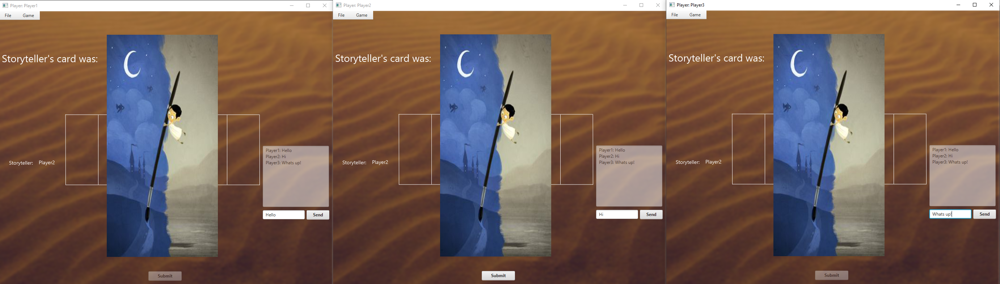
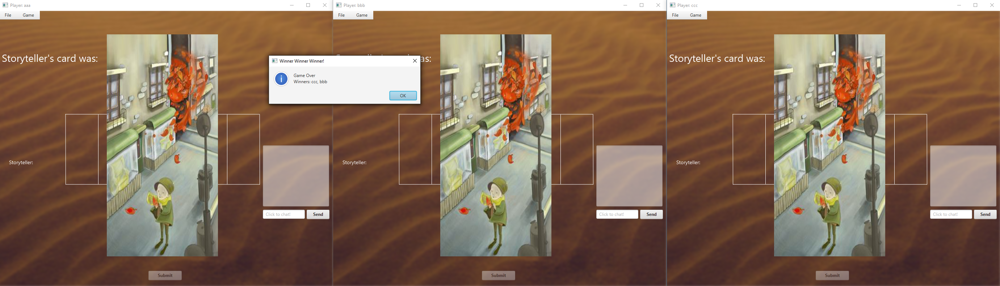
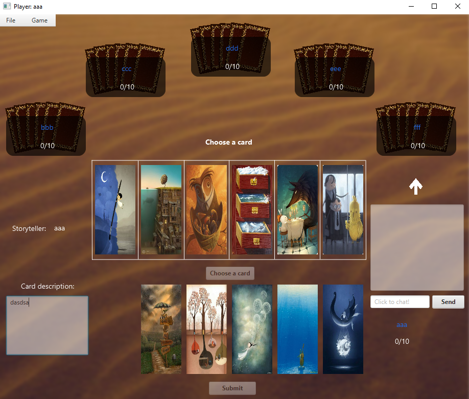

# Dixit
Multiplayer game made in JavaFX

### Project Images

## Project Description

This project is a desktop application for playing popular Dixit multiplayer game

### Technologies

- Custom made game engine logic that keeps track of players' turn, points and UI for each player
- Save/Load game with Serialization to .dat file
- Reflection API used for generating documentation
- Sending moves and other player data with TCP protocol, implemented using socket communication
- JNDI usage to separate hostname and port to a different file (conf.properties)
- RMI used for in game chat communication
- Responsive UI implemented using threads
- Using SAX/DOM parser to save configuration and game data in XML format and reading data to perform game replay

## How to run this project

- Run Server and ChatServer
- After that, run StartScreenController per player count
